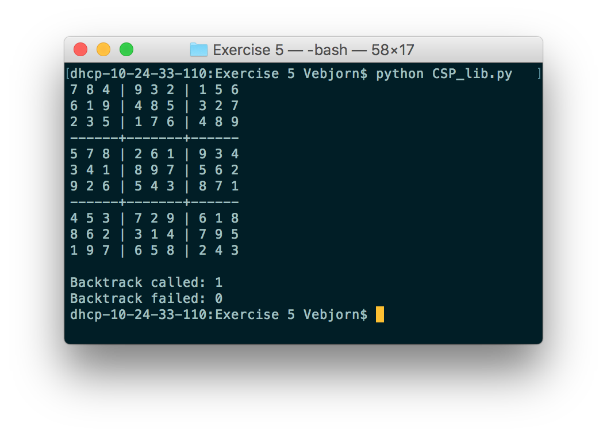
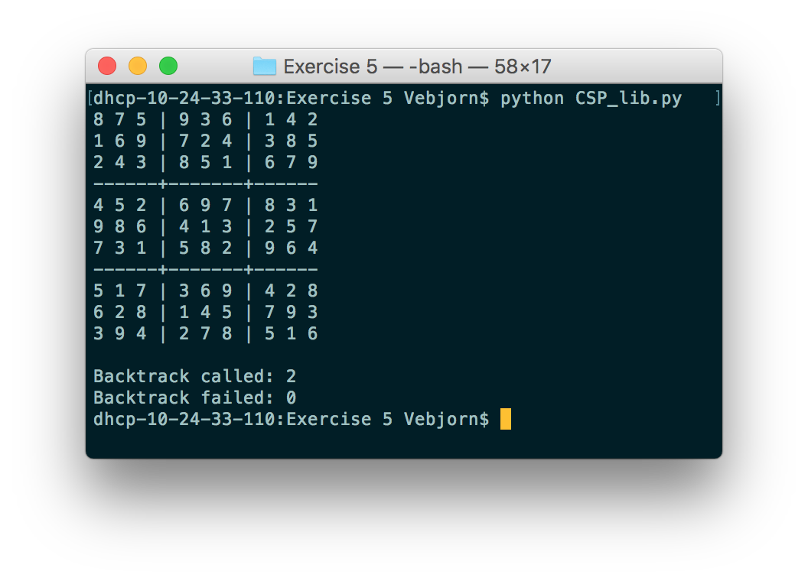
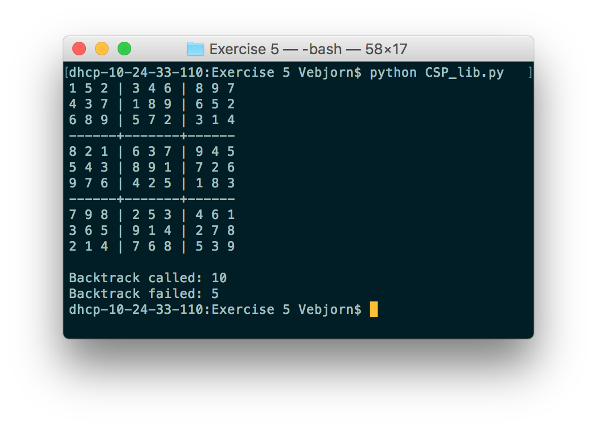
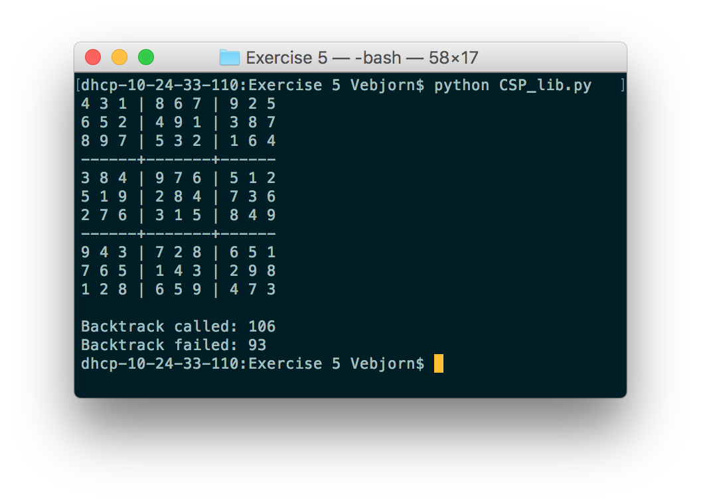

# TDT4136 Assignment 4 - Stian R. Hanssen and Vebjørn Isaksen

### Easy

It just needed one backtrack call, and did not fail.

### Medium

Here it needed 2 backtrack calls to place some values before solving the rest.

### Hard

The 5 failed backtrack is because those assignments could not be solved.

### Very hard

Same as above.

