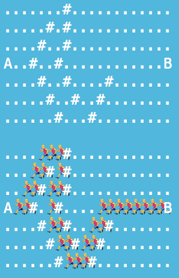
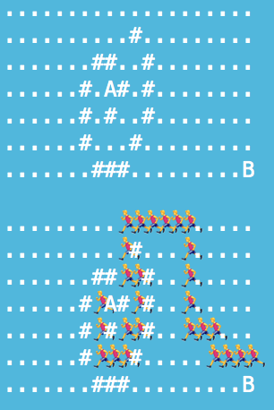
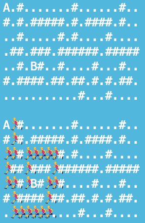
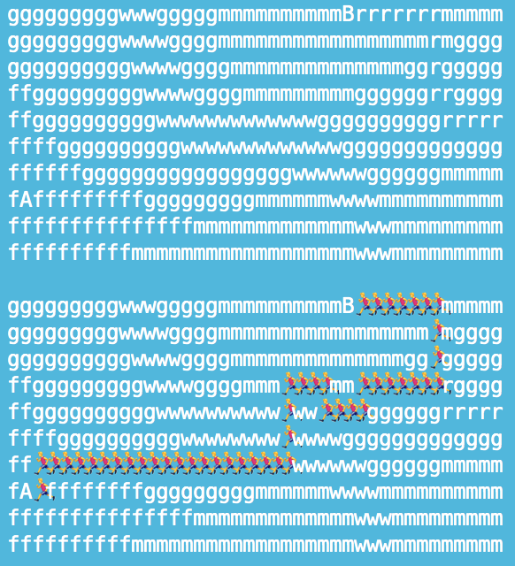
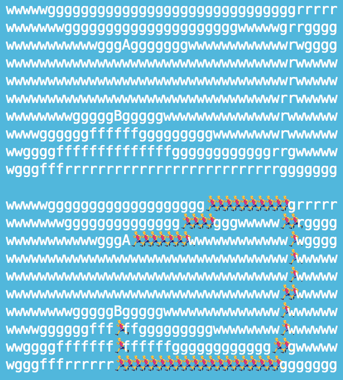
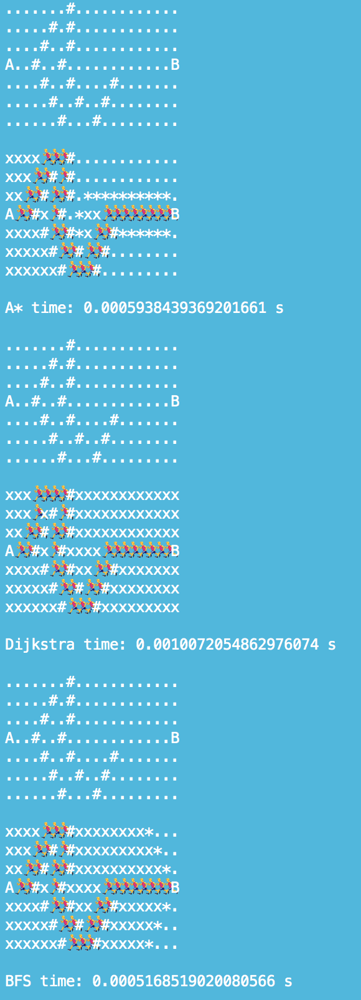
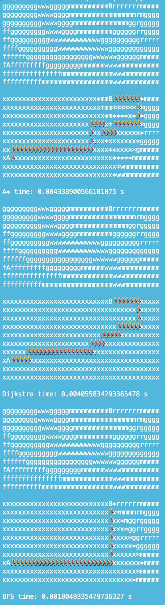
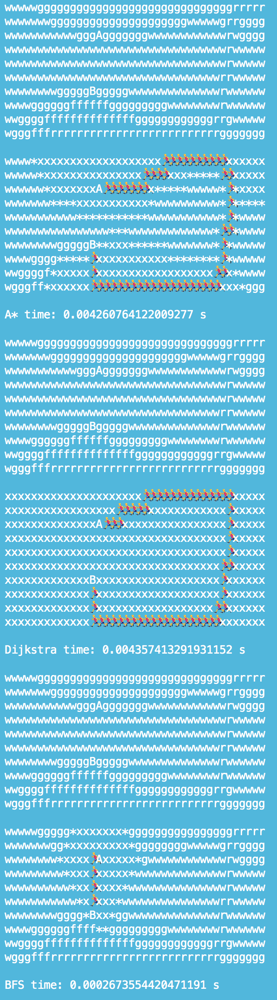

# Assignment 3 - Stian R. Hanssen og Vebjørn Isaksen

## A.1.1

See **a_star.py** for the algorithm. We wrote it by ourself.

## A.1.2

#### Board-1-1

#### Board-1-2

#### Board-1-3

#### Board-1-4

## A.2.1

See **a_star.py** for the algorithm.

## A.2.2

#### Board-2-1

#### Board-2-2

#### Board-2-3

#### Board-2-4

## A.3.1

See **a_star.py, dijkstra.py, bfs.py** for the algorithms. We wrote all by ourself.

## A.3.2

**x = closed  
* = open**

#### Board-1-1 A*, Dijkstra and BFS

#### Board-1-2 A*, Dijkstra and BFS

#### Board-1-3 A*, Dijkstra and BFS

#### Board-1-4 A*, Dijkstra and BFS

#### Board-2-1 A*, Dijkstra and BFS

#### Board-2-2 A*, Dijkstra and BFS

#### Board-2-3 A*, Dijkstra and BFS

#### Board-2-4 A*, Dijkstra and BFS

## A.3.3

**We talked with TA Fredrik Berg and he said we only should point out the general differences for the three algorithms, instead of for each game board which would result in a lot of copy/paste.**

*a)*  

The path will be different because the use of queue and heap. A* will use the heuristic to find the path. Dijkstra and BFS will be more random as you can see at board-1-1. In dijkstra some cells may have the same value and thus depending on push order (which again depends on get_neighbours(self, cell)) and how heap orders, we may get various equally valid results. In bfs the order purely depends on which order get_neighbours(self, cell) retrieves neighbours.

*b)*  

A* will close fewer nodes because it uses the heuristic and can stop when it reaches B. BFS will close all until it reaches B and can do so because it does not use the weight, but number of edges to find shortest path. So BFS will expand in all direction until it reaches B, and when it does, the shortest path will be ca. radius of all closed nodes. Dijkstra will close every node and do care about the weight and therefore need to check every node. If you have one road (weight: 1) at the edge of a map and end when you reach B, then you will miss that road and potentially a shorter path.
