# Assignment 3 - Stian R. Hanssen og Vebjørn Isaksen

## A.1.1 

See **a_star.py** for the algorithm. We wrote it by ourself. 

## A.1.2

#### Board-1-1

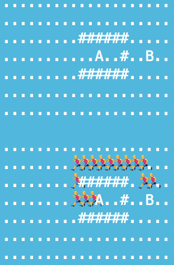

#### Board-1-2

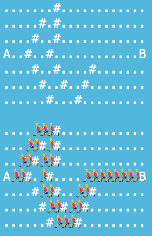

#### Board-1-3

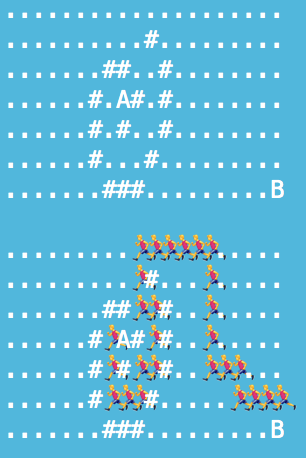

#### Board-1-4

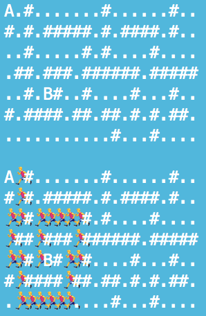

## A.2.1

See **a_star.py** for the algorithm.

## A.2.2

#### Board-2-1

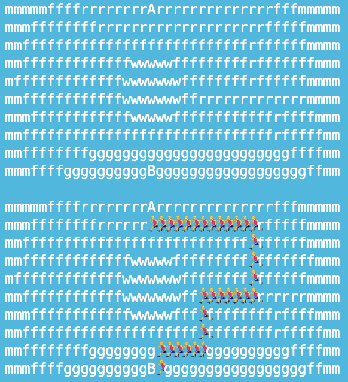

#### Board-2-2

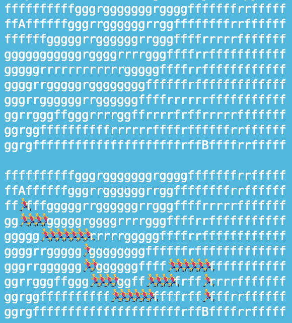

#### Board-2-3

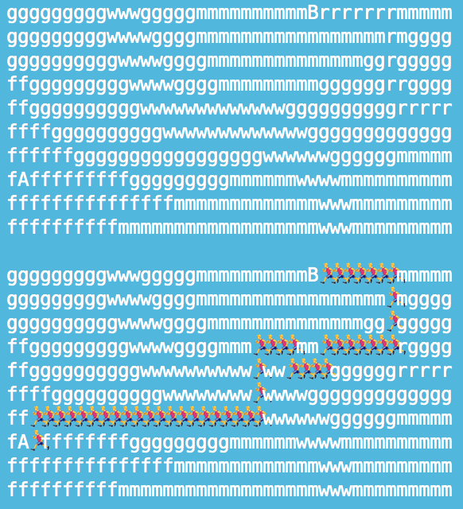

#### Board-2-4

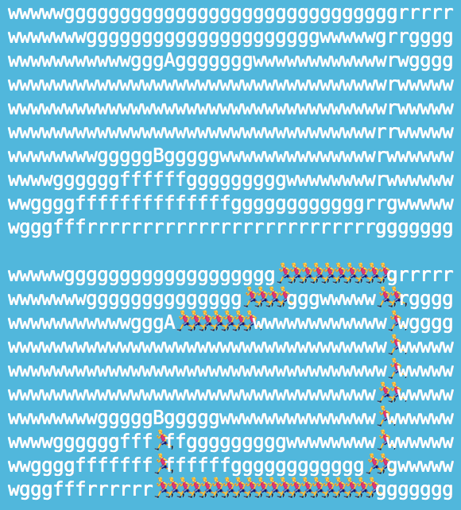

## A.3.1

See **a_star.py, dijkstra.py, bfs.py** for the algorithms. We wrote all by ourself. 

## A.3.2

#### Board-1-1 A*, Dijkstra and BFS

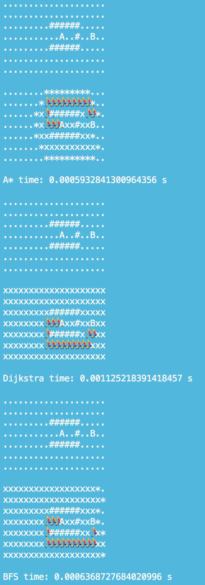

#### Board-1-2 A*, Dijkstra and BFS

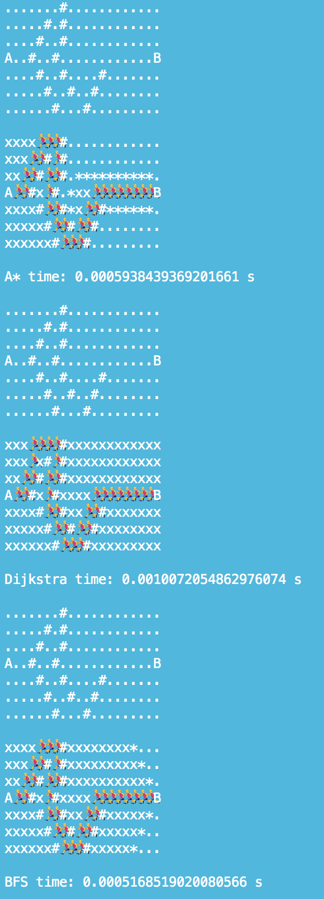

#### Board-1-3 A*, Dijkstra and BFS

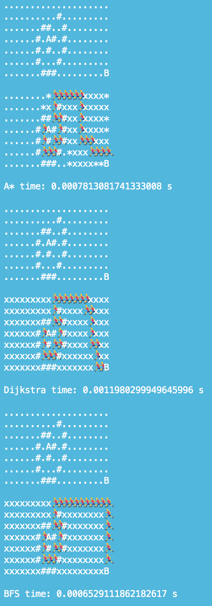

#### Board-1-4 A*, Dijkstra and BFS

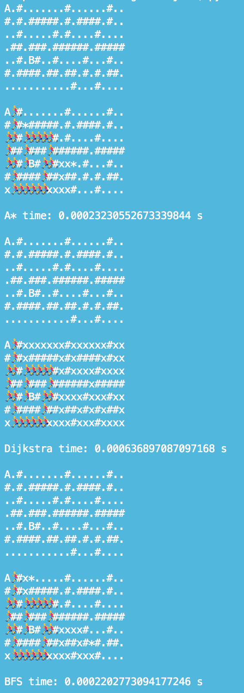

#### Board-2-1 A*, Dijkstra and BFS

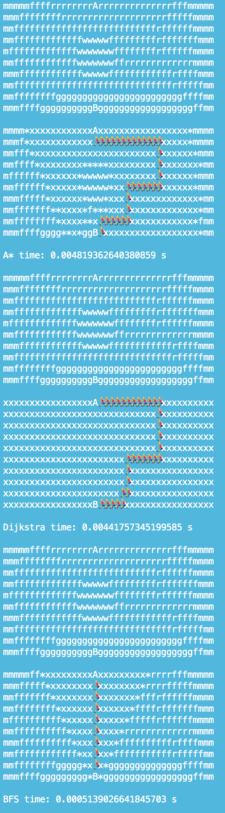

#### Board-2-2 A*, Dijkstra and BFS

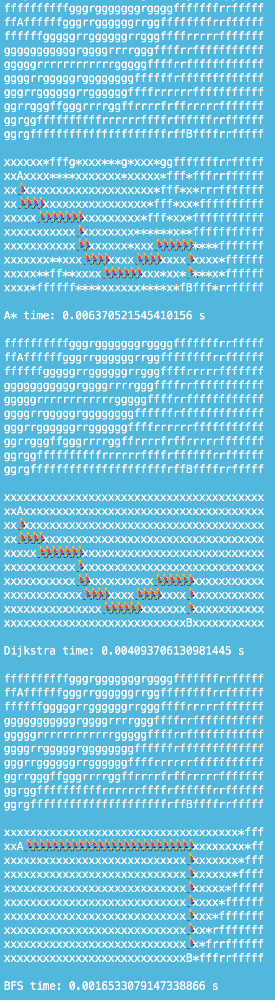

#### Board-2-3 A*, Dijkstra and BFS

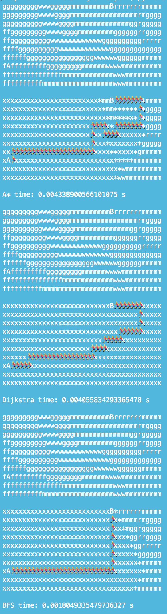

#### Board-2-4 A*, Dijkstra and BFS

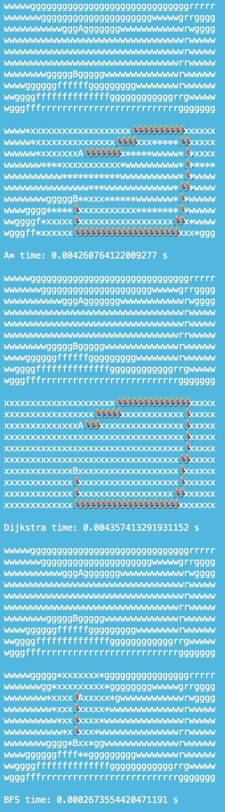

## A.3.3

